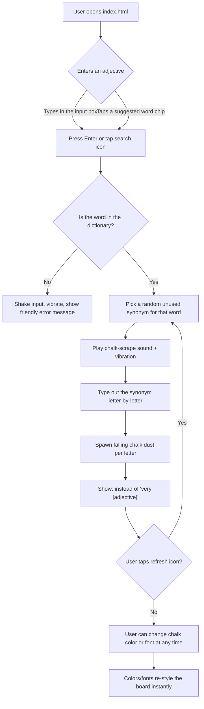

# Very Very Words

A chalk-on-blackboard vocabulary tool that replaces lazy "very + adjective" phrases (like "very happy") with a stronger single word (like "elated").

## Overview

Writers and students are told constantly to "avoid using 'very'" — but coming up with a better word on the spot is hard. Very Very Words solves that with a single, self-contained web page styled like a classroom blackboard: type or tap an everyday adjective (e.g. "sad", "big", "tired") and it chalks up a punchier synonym you can use instead, complete with a typewriter animation, chalk-tapping sound effects, and chalk dust particles.

It's a small, playful reference tool rather than an app with accounts or a backend — open the page and start typing.

## Key features

- **"Very + adjective" replacement** — enter a common adjective and get a stronger synonym to replace "very [adjective]" with
- **192 adjectives covered**, each mapped to 8 possible synonyms (roughly 1,500 words total), covering emotions (happy, sad, angry, scared...), size (big, tiny, vast...), quality (good, bad, perfect...), personality (kind, rude, stubborn...), and more
- **No-repeat shuffling** — the refresh button cycles to a new synonym for the same adjective without repeating one already shown, until the list is exhausted and reshuffles
- **Quick-pick word chips** — a scrollable tray of every supported adjective so users don't have to guess a word that's in the dictionary
- **Chalkboard aesthetic** — animated typewriter reveal, chalk dust particles that fall and fade, and a textured blackboard background
- **8 chalk colors and 5 handwriting fonts** — White, Gold, Rose, Sky, Mint, Plum, Peach, Ice; and Patrick Hand, Indie Flower, Shadows Into Light, Gloria Hallelujah, Architects Daughter (via Google Fonts)
- **Procedural sound effects** — chalk "tick" and "scrape" sounds synthesized live with the Web Audio API (no audio files)
- **Haptic feedback** — short vibration pulses on supported mobile devices (`navigator.vibrate`)
- **Friendly error state** — unrecognized words shake the input and prompt the user to pick one of the supported words instead
- **Mobile-friendly single page** — responsive sizing (`clamp()`), viewport meta tags, and Apple "add to home screen" meta tags

## Tech stack

- **Plain HTML, CSS, and vanilla JavaScript** — everything lives in one file, `index.html`
- **No build step, no package manager, no framework, no dependencies to install**
- **Google Fonts** (Indie Flower, Shadows Into Light Two, Patrick Hand, Gloria Hallelujah, Architects Daughter) loaded from a CDN `<link>` tag
- **Web Audio API** for the chalk sound effects (generated in-browser, not pre-recorded files)
- **Vibration API** for mobile haptics

## How it works



## Setup & installation

There is nothing to install — this is a single static HTML file with no dependencies to fetch and no build process.

1. Clone the repository:
   ```
   git clone https://github.com/srksourabh/very-very-words.git
   cd very-very-words
   ```
2. Open `index.html` directly in a browser (double-click it, or drag it into a browser window), **or** serve it with any static file server if you prefer a `localhost` URL, for example:
   ```
   npx serve .
   ```
   or
   ```
   python -m http.server 8000
   ```
   then visit the printed local URL.

An internet connection is needed the first time the page loads so it can fetch the Google Fonts; everything else runs entirely client-side.

## Usage

1. Pick a chalk color and a handwriting font from the strips at the top of the board (optional — it defaults to white chalk and Patrick Hand).
2. Type an adjective into the input box (e.g. "tired") and press Enter, or tap a word from the chip tray at the bottom.
3. Watch the stronger synonym get "written" on the board (e.g. "exhausted" — instead of "very tired").
4. Tap the refresh icon next to the result to cycle to a different synonym for the same word.
5. If a word isn't recognized, the board shakes and suggests picking one of the words from the tray below.
